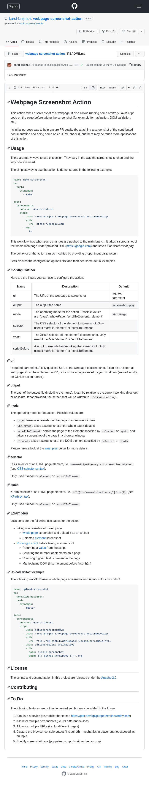
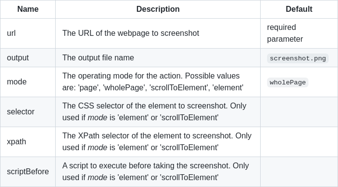

# Webpage Screenshot Action

This action takes a screenshot of a webpage. 
It also allows running some arbitrary JavaScript code on the 
page before taking the screenshot (for example for navigation, DOM validation, etc.). 

Its initial purpose was to help ensure PR quality
(by  attaching a screenshot of the contributed documentation and doing some basic HTML checks), 
but there may be much more applications of this action. 

## Usage

There are many ways to use this action. 
They vary in the way the screenshot is taken and the way how it is used.

The simplest way to use the action is demonstrated in the following example:

```yaml
name: Take screenshot
on:
  push:
    branches:
      - main

jobs:
  screenshots:
    runs-on: ubuntu-latest
    steps:
      - uses: karol-brejna-i/webpage-screenshot-action@develop
        with:
          url: https://google.com
      - run: |
          ls
```

This workflow fires when some changes are pushed to the main branch. 
It takes a screenshot of the whole web page under provided URL (https://google.com) and saves it as _screenshot.png_.

The behavior or the action can be modified by providing proper input parameters.

Let's discuss the configuration options first and then see some actual examples. 

### Configuration

Here are the inputs you can use to configure the action:

| Name         | Description                                                                                               | Default            |
|--------------|-----------------------------------------------------------------------------------------------------------|--------------------|
| url          | The URL of the webpage to screenshot                                                                      | required parameter |
| output       | The output file name                                                                                      | `screenshot.png`   |
| mode         | The operating mode for the action. Possible values are: 'page', 'wholePage', 'scrollToElement', 'element' | `wholePage`        |
| selector     | The CSS selector of the element to screenshot. Only used if _mode_ is 'element' or 'scrollToElement'      |                    |
| xpath        | The XPath selector of the element to screenshot. Only used if _mode_ is 'element' or 'scrollToElement'    |                    |
| scriptBefore | A script to execute before taking the screenshot. Only used if _mode_ is 'element' or 'scrollToElement'   |                    |


#### url
Required parameter. A fully qualified URL of the webpage to screenshot.
It can be an external web page, it can be a file from a PR, or it can be a page served by your workflow (served locally, on GitHub action runner).

#### output
The path of the output file (including the name). It can be relative to the current working directory, or absolute.
If not provided, the screenshot will be written to `./screenshot.png`.

#### mode
The operating mode for the action. Possible values are:
- `page`: takes a screenshot of the page in a browser window
- `wholePage`: takes a screenshot of the whole page( default)
- `scrollToElement`: scrolls the page to the element specified by `selector` or `xpath`
   and takes a screenshot of the page in a browser window
- `element`: takes a screenshot of the DOM element specified by `selector` or `xpath`

Please, take a look at the [examples](#examples) below for more details.

#### selector
CSS selector of an HTML page element, i.e. `#www-wikipedia-org > div.search-container` (see [CSS selector syntax](https://developer.mozilla.org/en-US/docs/Web/CSS/CSS_Selectors)). 

Only used if _mode_ is `element` or `scrollToElement`.

#### xpath
XPath selector of an HTML page element, i.e. `//*[@id="www-wikipedia-org"]/div[1]` (see [XPath syntax](https://developer.mozilla.org/en-US/docs/Web/XPath)).

Only used if _mode_ is `element` or `scrollToElement`.

### Examples
The [detailed examples](examples/README.md) show different aspects of the usage of the action.
- How the workflow is started
- What do we want to capture ("living" web page, a file from a PR, a page served by your workflow)
- How do we want to capture it (whole page, a specific element, a fragment of the page, etc.) 
- What do we want to do with the captured image (upload it to a PR, attach it to a release, etc.)


      Please, mind that the sole responsibility of the action is to take 
      a screenshot of a web page (or run a script for that page). 
      What is done with the screenshot is entirely up to you and should be handled by your workflow.

Here are some basic examples.

#### Full page screenshot + upload as an artifact 
The following workflow takes a whole page screenshot and uploads it as an artifact.



```yaml
name: Upload screenshot
on:
  workflow_dispatch:
  push:
    branches:
      - main

jobs:
  screenshots:
    runs-on: ubuntu-latest
    steps:
      - uses: actions/checkout@v3
      - uses: karol-brejna-i/webpage-screenshot-action@develop
        with:
          url: https://github.com/karol-brejna-i/webpage-screenshot-action/blob/main/README.md
      - uses: actions/upload-artifact@v3
        with:
          name: simple-screenshot
          path: ${{ github.workspace }}/*.png
```

[This workflow](examples/upload_artifact.yml) is fired when some changes are pushed to the main branch, or it can be triggered manually.
It makes a whole page screenshot of the README.md file and uploads it as an artifact.
On the right side, you can see the screenshot taken by the action.


#### Take a screenshot of first table in a document
The following workflow takes a screenshot of the first table in the README.md file and saves it in a file called `element.png`.



```yaml
name: Element's screenshot
on:
  workflow_dispatch:
  push:
    branches:
      - main

jobs:
  screenshots:
    runs-on: ubuntu-latest
    steps:
      - uses: actions/checkout@v3
      - uses: karol-brejna-i/webpage-screenshot-action@develop
        with:
          url: https://github.com/karol-brejna-i/webpage-screenshot-action/blob/main/README.md
          mode: element
          xpath: //table[1]
          output: element.png
      - uses: actions/upload-artifact@v3
        with:
          name: simple-screenshot
          path: ${{ github.workspace }}/*.png
```

[This workflow](examples/element.yml) is fired when some changes are pushed to the main branch, or it can be triggered manually.
It makes a whole page screenshot of the README.md file and uploads it as an artifact.
On the right side, you can see the screenshot taken by the action.


## License

The scripts and documentation in this project are released under the [Apache 2.0](LICENSE).

## Contributing

## To Do
The following features are not implemented yet, but may be added in the future:
1. Simulate a device (i.e.mobile phone; see https://pptr.dev/api/puppeteer.knowndevices/)
2. Allow for multiple screenshots (i.e. for different devices)
3. Allow for multiple URLs (i.e. for different pages)
4. Capture the browser console output (if required) - mechanics in place, but not exposed as an input
5. Specify screenshot type (puppeteer supports either jpeg or png)
