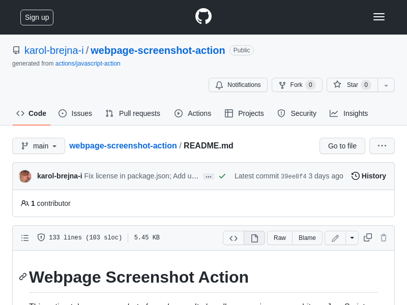

Main [README.md](../README.md) describes the action and its basic usage/configuration examples.


- taking a screenshot of a whole web page
- taking a screenshot of a specific page element
- some DOM manipulation and validation:
  - checking if an element exist
  - counting paragraph tags


Let's consider the following use cases for the action:
- taking a screenshot of a web page
  - [whole page](#full-page-screenshot--upload-as-an-artifact) screenshot and upload it as an artifact
  - Selected [element](#element) screenshot
- [Running a script](#running-a-script) before taking a screenshot
  - Returning a [value](#returning-a-value) from the script
  - Counting the number of elements on a page
  - Checking if given text is present in the page
  - Manipulating DOM (insert element before first \<h1\>)


#### Full page screenshot + upload as an artifact
The following workflow takes a whole page screenshot and uploads it as an artifact.

```yaml
name: Upload screenshot
on:
  workflow_dispatch:
  push:
    branches:
      - master

jobs:
  screenshots:
    runs-on: ubuntu-latest
    steps:
      - uses: actions/checkout@v3
      - uses: karol-brejna-i/webpage-screenshot-action@v1
        with:
          url: file://${{github.workspace}}/examples/simple.html
      - uses: actions/upload-artifact@v3
        with:
          name: simple-screenshot
          path: ${{ github.workspace }}/*.png
```

#### Pull Request example
Let's assume, that there is a GitHub repo with a markdown file (replace_in_place.md).
This file has some text, a table, and an embedded image showing that table.
```markdown
# My table
| **Category** | **Name**       |
|--------------|----------------|
| Gaming       | MrBeast Gaming |
| Gaming       | PewDiePie      |
| Gaming       | Markiplier     |
## The image

```
When a pull request is created, the table is updated, but the image is not.
The goal is to automatically take a screenshot of the table and replace the existing image with the new one, when
the pull request is created.

```yaml
name: Replace screenshot in PR
on:
  pull_request:
permissions:
  contents: write
jobs:
  add_screenshot:
    runs-on: ubuntu-latest
    steps:
      - name: Checkout the code
        uses: actions/checkout@v3
        with:
          repository: ${{ github.event.pull_request.head.repo.full_name }}
          ref: ${{ github.event.pull_request.head.ref }}
      - name: Configure git user
        run: |
          git config user.name github-actions
          git config user.email github-actions@github.com
      - name: Take a screenshot
        uses: karol-brejna-i/webpage-screenshot-action@v1
        with:
          url: ${{ github.event.repository.html_url }}/blob/${{ github.event.pull_request.head.ref }}/replace_in_place.md
          mode: element
          xpath: //table[1]
          output: images/embedded_image.png
      - name: Commit and push the changes
        run: |
          git add . && git commit -m "generated" && git status && git push
```
[This example](./replace_in_place.md) shows a workflow that:

- is triggered when Pull Request is created
- configures git user to be able to commit the changes
- takes a screenshot of a markdown file (from the GitHub web page)
- adds new image as a new commit to the PR
- pushes the changes, so they are "visible" in the PR


#### Take a screenshot of a page (default viewport)
The following workflow takes a whole page screenshot and uploads it as an artifact.



```yaml
name: Upload screenshot
on:
  workflow_dispatch:
  push:
    branches:
      - main

jobs:
  screenshots:
    runs-on: ubuntu-latest
    steps:
      - uses: actions/checkout@v3
      - uses: karol-brejna-i/webpage-screenshot-action@v1
        with:
          url: https://github.com/karol-brejna-i/webpage-screenshot-action/blob/main/README.md
          mode: page
      - uses: actions/upload-artifact@v3
        with:
          name: simple-screenshot
          path: ${{ github.workspace }}/*.png
```

[This workflow](examples/upload_artifact.yml) is fired when some changes are pushed to the main branch, or it can be triggered manually.
It makes a whole page screenshot of the README.md file and uploads it as an artifact.
On the right side, you can see the screenshot taken by the action.

