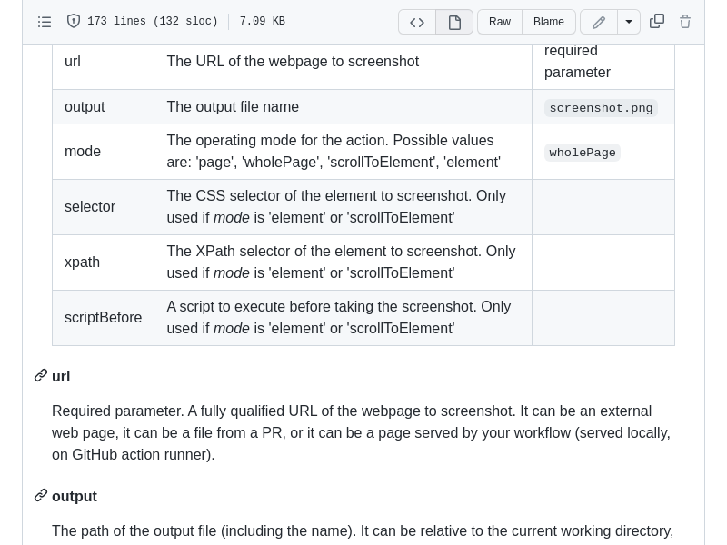

# Basic examples

This document describes basic usage/configuration examples of the action.

They focus mostly on WHAT is captured, not how the workflow was triggered or what happens with the captured image.


#### Full page screenshot
The following workflow takes a whole page screenshot and uploads it as an artifact.


```yaml
name: Upload screenshot
on:
  workflow_dispatch:
  push:
    branches:
      - main
jobs:
  screenshots:
    runs-on: ubuntu-latest
    steps:
      - uses: karol-brejna-i/webpage-screenshot-action@v1
        with:
          url: https://github.com/karol-brejna-i/webpage-screenshot-action/blob/main/README.md
      - uses: actions/upload-artifact@v3
        with:
          name: simple-screenshot
          path: ${{ github.workspace }}/*.png
```

[This workflow](./upload_artifact.yml) is fired when some changes are pushed to the main branch, or it can be triggered manually.
It makes a whole page screenshot of the README.md file and uploads it as an artifact.
On the right side, you can see the screenshot taken by the action.


#### Take a screenshot of first table in a document
Let's assume that you want to make a screenshot of the first table in a document.


```yaml
name: Element's screenshot
on:
  workflow_dispatch:

jobs:
  screenshots:
    runs-on: ubuntu-latest
    steps:
      - uses: karol-brejna-i/webpage-screenshot-action@v1
        with:
          url: https://github.com/karol-brejna-i/webpage-screenshot-action/blob/main/README.md
          mode: element
          xpath: //table[1]
          output: element-screenshot.png
      - uses: actions/upload-artifact@v3
        with:
          name: simple-screenshot
          path: ${{ github.workspace }}/*.png
```

[This workflow](./element.yml) takes a screenshot of the first table in the README.md file and saves it in a file called `element.png`.
The element to capture is specified by the XPath selector `//table[1]`.

#### Scroll view to a specific element and take a screenshot
Let's see the difference between `scrollToElement` and `element` modes.



```yaml
name: Screenshot from a scrolled page
on:
  workflow_dispatch:

jobs:
  screenshots:
    runs-on: ubuntu-latest
    steps:
      - uses: karol-brejna-i/webpage-screenshot-action@v1
        with:
          url: https://github.com/karol-brejna-i/webpage-screenshot-action/blob/main/README.md
          mode: scrollToElement
          xpath: //table[1]
          output: scroll-to-element-screenshot.png
      - uses: actions/upload-artifact@v3
        with:
          name: simple-screenshot
          path: ${{ github.workspace }}/*.png
```

[This workflow](./scroll_to_element.yml) opens the README.md file,
scrolls the view to the first table (`xpath: //table[1]`) and takes a screenshot of the page.  
It saves the screenshot in a file called `element.png`.


Please, mind that for `element` mode only the specified element is captured.
In `scrollToView` the screenshot captures the viewport starting from the element (so the following elements are also included).

#### Local file screenshot
The action can also take a screenshot of a local file.
```yaml
name: Local file screenshot
on:
  workflow_dispatch:
  push:
    branches:
      - master

jobs:
  screenshots:
    runs-on: ubuntu-latest
    steps:
      - uses: karol-brejna-i/webpage-screenshot-action@v1
        id: screenshot
        with:
          url: file://${{github.workspace}}/examples/simple.html
```

[This workflow](./local_file.yml) checks out the repository and takes a screenshot of one of the files in the repo (`./simple.html`).

Please, note how the URL is constructed. The `file://` prefix is used to specify that the file is local
and the `${{github.workspace}}` variable is used to resolve the path where git repository was checked out.
This could be any path on the machine where the action is running, as long as it constitutes a valid URL.

